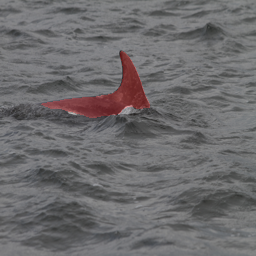
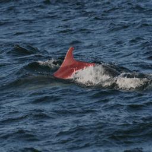
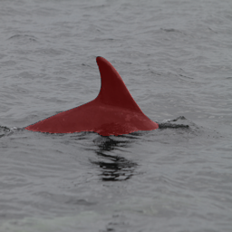
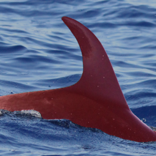
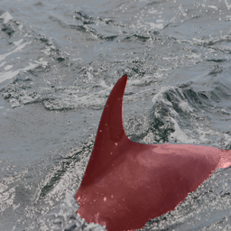
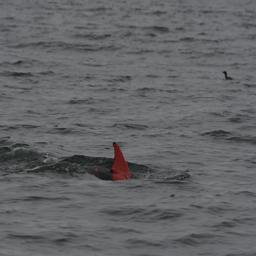
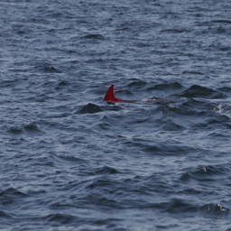

# Dolphin segmentation

## Описание проекта

### Содержание
 1. [Обучение](#start)
 2. [Примеры работы](#examples)
 3. [Тест](#inference)
 4. [Ссылки](#datasets)


### Обучение <a name="start"></a>

Для повторения эксперимента используйте следующую инструкцию:

#### Прежде всего, склонируйте репозиторий себе на локальный компьютер и получите к нему доступ с помощью команды

```bash
git clone https://github.com/Alexadr45/dolphin_segmentation.git
cd dolphin_segmentation
```

#### Затем установите необходимые библиотеки с помощью команды

```bash
pip install -r requirements.txt
```

#### Поменяйте параметры в train_config.py

- Путь до изображений
- Пути к маскам


#### Запустите обучение

```bash
python3 train.py
```


### Примеры работы <a name="examples"></a>

   
   


### Тест <a name="inference"></a>

инструкция по использованию


### Ссылки <a name="datasets"><a/>
#### NDD20
https://data.ncl.ac.uk/collections/The_Northumberland_Dolphin_Dataset_2020/4982342/1
#### Happywhale
https://www.kaggle.com/c/happy-whale-and-dolphin
