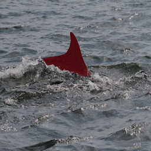

# Разработка модели сегментации морских млекопитающих

## Описание проекта

Данный проект является выпускной квалификационной работой по направлению Инженерия искусственного интеллекта на магистратуре УрФУ ИРИТ-РТФ. Разработанный инструмент предназначен для сегментации дельфинов.

Модель - Unet++

Энкодер - Efficientnet-b4

Достигнутая IoU составляет 0.95

## Содержание
 1. [Обучение](#start)
 2. [Примеры работы](#examples)
 3. [Использование готовой модели](#inference)
 4. [Ссылки](#datasets)


### Обучение <a name="start"></a>

Для повторения эксперимента используйте следующую инструкцию:

#### Прежде всего, склонируйте репозиторий себе на локальный компьютер и получите к нему доступ с помощью команды

```bash
git clone https://github.com/Alexadr45/dolphin_segmentation.git
cd dolphin_segmentation
```

#### Затем установите необходимые библиотеки с помощью команды

```bash
pip install -r requirements.txt
```

#### Подготовьте данные и поменяйте параметры в train_config.py

Установите в параметры image_path, train_directory и val_directory пути до изображений и масок соответственно.

- Для предобработки данных можно воспользоваться скриптами из create_masks.py
- Готовый датасет можно скачать с помощью:

```python
gdown.download(id="11P69iYyhy3tgq146CARsJ81TpDpcEeC4", output=InferenceConfig.model_path, quiet=False)
```

#### Запустите обучение

```bash
python3 train.py
```


### Примеры работы <a name="examples"></a>

        


### Использование готовой модели <a name="inference"></a>

Можно воспользоваться готовой моделью для сегментации одного или сразу нескольких изображений в каталоге, для этого используйте следующую инструкцию:

#### Прежде всего, склонируйте репозиторий себе на локальный компьютер и получите к нему доступ с помощью команды

```bash
git clone https://github.com/Alexadr45/dolphin_segmentation.git
cd dolphin_segmentation
```

#### Затем установите необходимые библиотеки с помощью команды

```bash
pip install -r requirements.txt
```

#### Измените параметры в файле Inference_config.py

- Установите путь до изображения в параметр directory_or_image_path
- Чтобы сделать предикт для нескольких изображений, установите параметр directory = False и в параметр directory_or_image_path укажите путь до каталога

#### Запустите скрипт

```bash
python3 Inference.py
```

### Ссылки <a name="datasets"><a/>

#### Используемые инструменты:
- [[SMP](https://smp.readthedocs.io/en/latest/index.html)] - библиотека с предварительно обученными моделями сегментации
- [[Tensorboard](https://www.tensorflow.org/?hl=ru)] - для отслеживания прогресса обучения
- [[Albumentations](https://albumentations.ai/)] - аугментации
- [[AnyLabeling](https://anylabeling.nrl.ai/)] - для разметки данных

#### Датасеты

- [[NDD20](https://data.ncl.ac.uk/collections/The_Northumberland_Dolphin_Dataset_2020/4982342/1)] - размеченный датасет, содержащий 2201 фотографий надводных дельфинов
- [[Happywhale](https://www.kaggle.com/c/happy-whale-and-dolphin)] - неразмеченный датасет, содержащий более 90 тысяч фотографий дельфинов и китов
- [[Размеченные фото из happywhale](https://drive.google.com/drive/folders/1d9s9dGq7FeU-G-LTQkNaCKnWmdhKjjlg?usp=drive_link)] - 1117 размеченных фотографий дельфинов класса bottlenose
